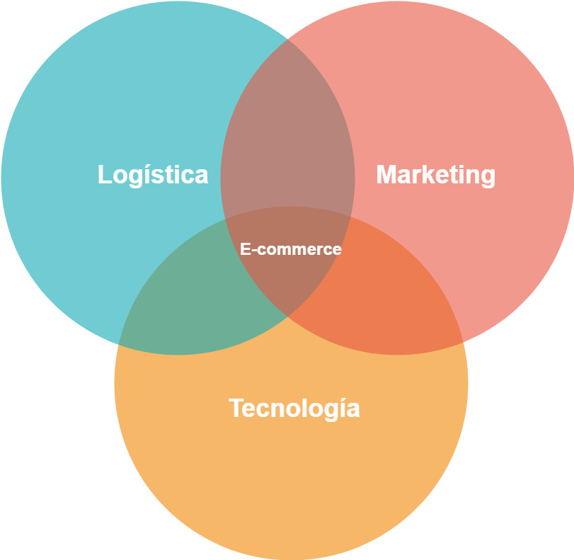
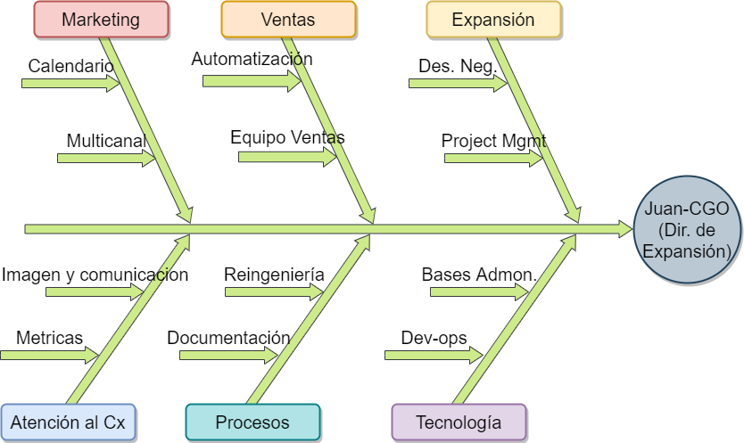

<style>
 #TOC {
  color: #708090;
  font-family: Calibri;
  font-size: 16px; 
  border-color: #708090;
}
 #header {
  color: #F08080;
  background-color: #F5F5F5;
  opacity: 0.6;
  font-family: Calibri;
  font-size: 40px;
}
h2.title {
  color: #F08080;
  background-color: #F5F5F5;
  opacity: 0.6;
  font-family: Calibri;
  font-size: 35px;
}
h4.author {
  color: #708090;
  font-family: Calibri;
  background-color: #F5F5F5;
}
h4.date {
  color: #708090;  
  font-family: Calibri;
  background-color: #F5F5F5;
}
body {
  color: #708090;
  font-family: Calibri;
  background-color: #F5F5F5;
  font-size: 25px;
}
pre {
  color: #708090;
  background-color: #F8F8FF;
}
</style>


```{r Initialsetup, echo=FALSE, message=FALSE, warning=FALSE}
#rm(list = ls())
libs <- c("dplyr", "plm",  "stargazer","ggplot2","readxl","tidyr", "tibble","directlabels", "ggthemes", "RColorBrewer", "knitr", "stringr","sjPlot", "sjmisc", "sjlabelled",'tinytex')
for (i in libs) {
  if(!is.element(i,.packages(all.available = TRUE))) {
    install.packages(i,repos="https://cran.revolutionanalytics.com/")
  }
  library(i,character.only = TRUE)
}

```
```{r Markdownsetup, include=FALSE}
knitr::opts_chunk$set(fig.align = 'center', out.width="90%", echo = TRUE)
#install.packages("rlang")
#detach(package:plyr)
#install.packages('tinytex')
#tinytex::install_tinytex()  # install TinyTeX
#
#sapply(ls(),FUN = function(x){class(get(x))[[1]]})

```
```{r Datasets, echo=FALSE, message=FALSE, warning=FALSE}
#PDINEGI<-read.csv("PDINEGI.csv", header = TRUE)
#PDINEGI<-pdata.frame(PDINEGI,c("estado","yr"))

#PDWDI$yr<-as.numeric(as.character(PDWDI$yr))
#sapply(ls(),FUN = function(x){class(get(x))[[1]]})
#sapply(c(PDINEGI, PDWDI, VA.PIB.INEGI), class)
```

# Los 3 elementos imprescindibles del Comercio Electrónico que son clave del éxito

 - Identifica las oportunidades de tu negocio en línea.
 - Crea tu estrategia de ecommerce y expansión del ingreso.
 - 3 elementos clave = 3 soluciones gratis
 

## ¿Quién Soy?.

{height=70%}

Link a CV: https://github.com/srgenial/resumejuan/blob/master/Resume-commercial-spanish.pdf

{width=100%}


# __La Estrategia de ecommerce para negocios exitosos__

__Ecommerce implica estrategia__


## ¿Cómo se logra?

Dibujamos un mapa estratégico que vincula los activos tangibles y los procesos críticos a la propuesta de valor al cliente y a los resultados financieros.

 - Planeación
 - Organización
 - Ejecución
 - Control

## __Desarrollo de un plan estratégico__

Los CEO's de las empresas buscan integrarse verticalmente  a su sector de la industria, por ejemplo energía solar, insumos hidropónicos, venta de productos artesanalaes, etc.

## Plan para ventas al cliente final (consumidor)

## Integración vertical de según su capacidad instalada  (oferta)


# __Dirigir y decidir__

## Desarrollar relaciones comerciales de Largo Plazo

# Online vs Offline

## Investigación de Mercado

La situación actual requiere de una estrategia clara y profunda capaz de unificar las fortalezas y oportunidades de las empresas para accesar a un porción mayor del mercado.

Una Mayor participación en la demanda está invirtiendo en el ECOMMERCE 

Esto no es solo por la pandemia, es un efecto que vengo estudiando en mi tesis

# __B2B y B2C en 3 claves__

__ Las grandes empresas concentran sus esfuerzos de progreso 3 grandes rubros__

  - Marketing de ventas
  - Logística en suministro y despacho
  - Tecnología propia con valor aggregado


{width=70%}


# ¿Quién DIRIGE esa visión?

## Dirección de expansión o Chief Growth Officer (CGO).

### ¿Qué es un CGO?

El complemento perfecto para un CEO

###  director general + director de operaciones 

Si las debilidades para expandirse se concentran en Marketing y Tecnología necesitas un CGO.



Sabemos que problemas multisectoriales requieren dirección multidepartamental.


# ¿Cómo lo lograremos?
## Arquitectura estatégica en conjunto

Dibujaremos un mapa estratégico que vincula los activos tangibles y los procesos críticos a la propuesta de valor al cliente y a los resultados financieros.

 

## Rescates Teóricos

El inicio está en un análisis FODA por área.

Medición a través de las 5 fuerzas de Porter y aplicar un Balance Score Card a largo plazo.

Trabajo semanalmente en la obtención indicadores clave mensualmente para organización y control de las operaciones críticas para la expansión en:

 * Finanzas

 * Operación interna

 * Ingreso

 * Crecimiento y tecnología

# Crea tu tienda en Shopify como un experto


