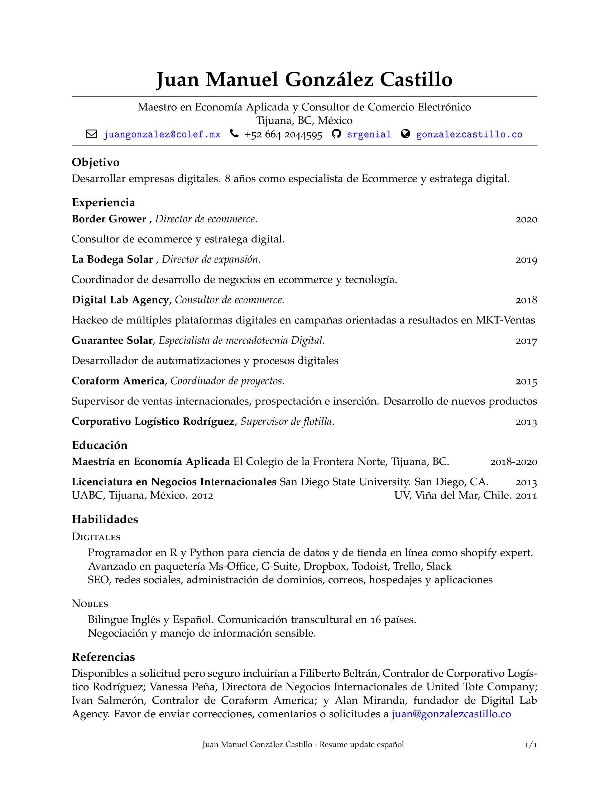
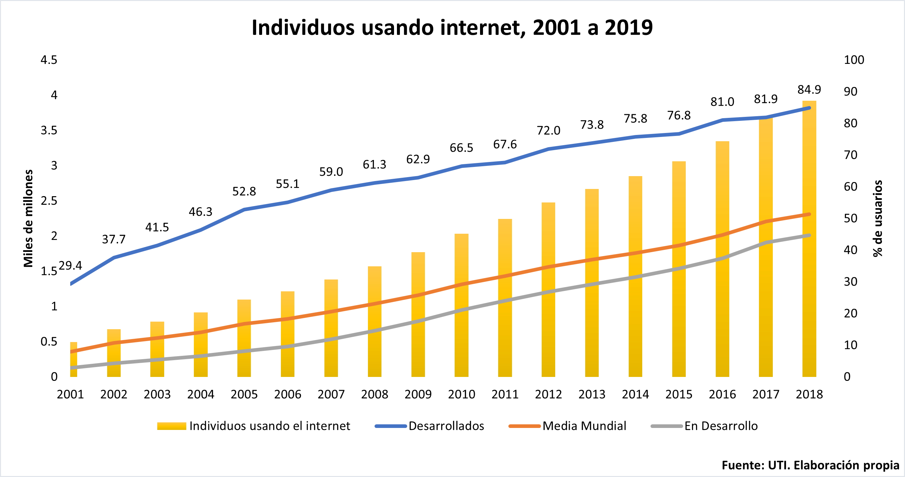

<style>
.forceBreak { -webkit-column-break-after: always; break-after: column; }
</style>

```{r Initialsetup, echo=FALSE, message=FALSE, warning=FALSE}
#rm(list = ls())
libs <- c("dplyr", "plm",  "stargazer","ggplot2","readxl","tidyr", "tibble","directlabels", "ggthemes", "RColorBrewer", "knitr", "stringr","sjPlot", "sjmisc", "sjlabelled",'tinytex')
for (i in libs) {
  if(!is.element(i,.packages(all.available = TRUE))) {
    install.packages(i,repos="https://cran.revolutionanalytics.com/")
  }
  library(i,character.only = TRUE)
}

```

```{r Markdownsetup, include=FALSE}
knitr::opts_chunk$set(fig.align = 'center', out.width="90%", echo = TRUE)
#install.packages("rlang")
#detach(package:plyr)
#install.packages('tinytex')
#tinytex::install_tinytex()  # install TinyTeX
#
#sapply(ls(),FUN = function(x){class(get(x))[[1]]})

```

```{r Datasets, echo=FALSE, message=FALSE, warning=FALSE}
#PDINEGI<-read.csv("PDINEGI.csv", header = TRUE)
#PDINEGI<-pdata.frame(PDINEGI,c("estado","yr"))

#PDWDI$yr<-as.numeric(as.character(PDWDI$yr))
#sapply(ls(),FUN = function(x){class(get(x))[[1]]})
#sapply(c(PDINEGI, PDWDI, VA.PIB.INEGI), class)
```

# Los 3 elementos imprescindibles del Comercio Electrónico que son clave del éxito

## Resumen {.build}

 - Identificar las oportunidades de tu negocio en línea.
 - Estrategia de ecommerce y expansión del ingreso.
 - 3 elementos clave = 3 soluciones 
 

## ¿Quién soy?

{width=80%}

# Curriculum | 8 Experiencia + Cientificidad {.build}


Link a CV: https://github.com/srgenial/resumejuan/blob/master/Resume-commercial-spanish.pdf


##

```{r CV, echo = FALSE, message=FALSE, fig.align='center', fig.cap='RESUME'}

```
# __Dirigir y decidir__


## Online vs Offline

Se prevé que los ingresos en el mercado del comercio electrónico alcancen los 18,764 millones de dólares en 2020.

Se espera que los ingresos muestren una tasa de crecimiento anual (CAGR 2020-2024) del 6,6%, lo que resultará en un volumen de mercado proyectado de 24,208 millones de dólares para 2024.

Fuente: Statista 2020


## Cliente como centro de la estrategia de Ecommerce {.columns-2 .smaller .built}

  - La AR mejora la realidad de las compras en línea.
  - Habrá un volumen creciente de búsqueda por voz.
  - La AI ayuda a las tiendas a conocer a los compradores.
  - La personalización en el sitio utiliza esos conocimientos para crear experiencias individualizadas.
  - Los grandes datos juegan un gran papel en la creación de experiencias personalizadas. 
  - Los robots de chat mejoran la experiencia de compra.

<p class="forceBreak"></p>

  - Las compras por móvil van en aumento. 
  - Más formas de pago. 
  - El comercio electrónico sin cabeza y basado en API permite una innovación continua. 
  - Los clientes responden al video.
  - Las suscripciones hacen que los clientes vuelvan.
  - La sostenibilidad es cada vez más importante.
  - Las empresas deben optimizar la estrategia digital para la conversión.
  - El B2B está creciendo y cambiando.


## Desarrollo de relaciones comerciales de Largo Plazo

```{r int www, echo = FALSE, message=FALSE, fig.align='center', fig.cap='Internet a nivel mundial'}

```


# Una Mayor participación en la demanda está invirtiendo en el ECOMMERCE 

## 2020

La situación actual requiere de una estrategia clara y profunda capaz de unificar las fortalezas y oportunidades de las empresas para accesar a un porción mayor del mercado.


Esto no es solo por la pandemia, es un efecto que vengo estudiando desde 2018 cuando en mi tesis encontré una correlación a través de MCO y VI para el Internet y el PIB percápita de las naciones de la OCDE y en particular en México y sus 32 entidades federativas.

#

```{r int mex, echo=FALSE, fig.align='center', fig.cap='Internet en México', message=FALSE}
knitr::include_graphics("intmex.png")
```

# La Estrategia de ecommerce para negocios exitosos

## Desarrollo de un plan estratégico

Los Directores Generales o CEOs de las empresas buscan integrarse verticalmente  a su sector de la industria, por ejemplo energía solar, insumos hidropónicos, venta de productos artesanales, entre otros. 

Muchos han comprendido que no basta con la compra y distribución, la publicidad online, redes y plataformas de venta.


## ¿Cómo se logra?

Dibujamos un mapa estratégico que vincula los activos tangibles y los procesos críticos en la propuesta de valor al cliente con los resultados financieros de la empresa.

 - Planeación - Gantt
 - Organización - To-do-list
 - Ejecución - Shopify
 - Control -  #rstats analytics


# B2B y B2C en 3 claves


## Las grandes empresas concentran sus esfuerzos de progreso 3 grandes rubros

  - Marketing de ventas
  - Logística en suministro y despacho
  - Tecnología propia con valor aggregado

# 

```{r Venn,  echo = FALSE, message=FALSE, fig.align='center', out.width="90%", fig.cap='Internet a nivel mundial'}
knitr::include_graphics("Venn Diagram.png")
```

## Plan de ventas al cliente final (consumidor)

Marketing de ventas

## Integración vertical según su capacidad instalada  (oferta)

Logistica en suministro y despacho

## Capacidad Financiera

Tecnología propia con valor agregado


# ¿Quién DIRIGE esa estrategia?

## Chief Growth Officer- CGO.


### ¿Qué es un CGO?


El complemento perfecto para un CEO. También llamado Director de Expansión.


###  director general + director de operaciones 


Si las debilidades para expandirse se concentran en Marketing y Tecnología necesitas un CGO.


#

Comprender que problemas multisectoriales requieren dirección multidepartamental.

{width=190%}


## Arquitectura estatégica

{width=100%}

##

Dibujamos un mapa estratégico que vincula los activos tangibles y los procesos críticos a la propuesta de valor al cliente y a los resultados financieros.

{width=100%}


## Rescates Teóricos

  - El inicio está en un análisis FODA por área.

  - Medición del mercado a través de las 5 fuerzas de Porter 

  - Aplicar un Balance Score Card a largo plazo.

Trabajo semanalmente en la obtención indicadores clave mensualmente para organización y control de las operaciones críticas para la expansión en:

 * Finanzas

 * Operación interna

 * Atención al cliente

 * Crecimiento y aprendizaje


# Crea tu tienda en Shopify como un experto

{width=50%}


